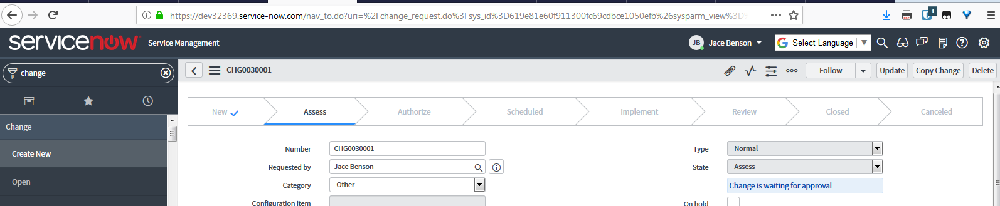
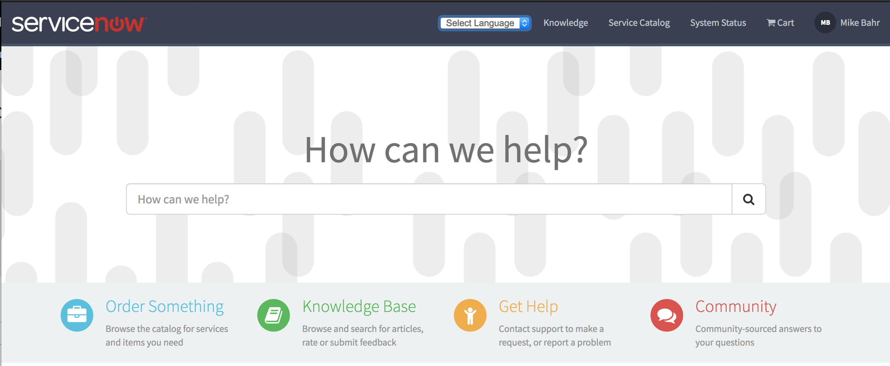
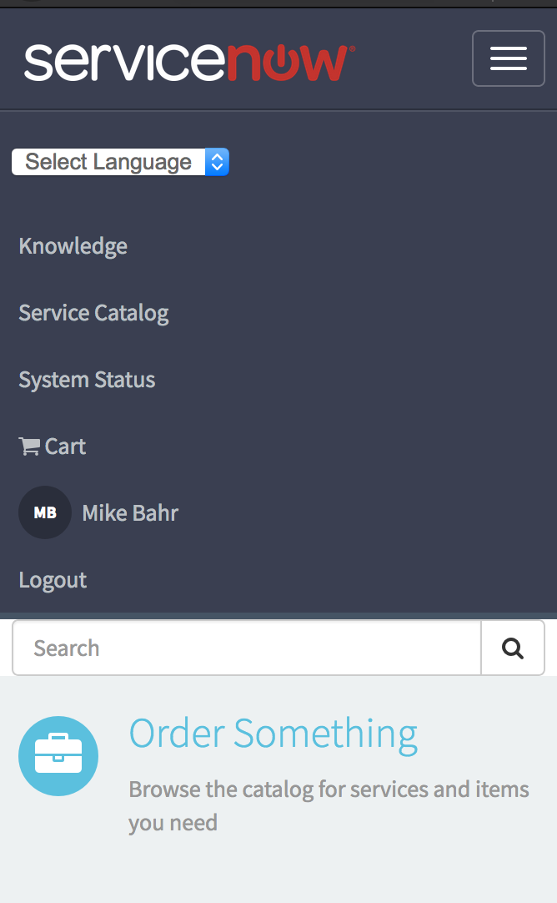

# snGoogleTranslate

Google Translate and ServiceNow integration.

## Requirements

- [Google Translate Account][1]
- UI16
- Istanbul, Jakarta, Kingston releases
- Service Portal

## UI16 Instructions

### Google Translate Instructions

1. Browse to: [Google Translate Account][1] and log in.
1. Click "Add Website now" and enter your instance.
1. Click "Next" on Plugins Settings section (this can be changed at anytime).

### Instance Instructions

1. Go to Retrieved Update Sets and select Import XML
1. Import the XML file, preview, and then commit the update set. (UI Script source code is in src.js)
1. Refresh your page and you should now see Google Translate in the upper right corner by your profile.

After all is done you're normal UI should look like

[1]: https://translate.google.com/manager/website]

## Service Portal Header Instructions

1. Browse to Service Portal > Themes in the left navigator
1. Select a theme such as the Stock theme
1. Change the header from Stock Header to Stock Header w/ Google Translate
1. Click on Update
1. Browse to instance-name.service-now.com/sp

Your Service Portal header should look like

Mobile

