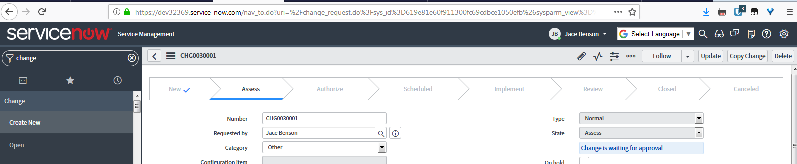
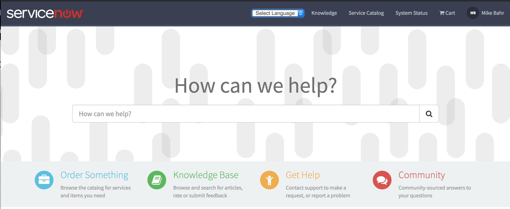
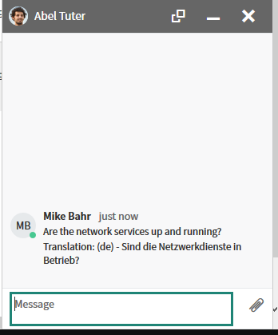

# snGoogleTranslate

Google Translate and ServiceNow integration.

## What's new?

- Properties Page
- Connect Translate
- Import Dictionary Labels
- Import Choices

## Requirements

- UI16
- Istanbul, Jakarta, Kingston, London, Madrid releases
- Service Portal

## Installation

1. Go to Retrieved Update Sets and select Import XML
2. Import the XML file, preview, and then commit the update set.
3. Browse to snGoogleTranslate > Properties in the left navigation to view all the features included.

## UI16 Instructions

1. Browse to snGoogleTranslate > Properties
1. Enable the UI16 property
1. Your screen should look like the below screenshot

### Configure available languages

1. In the snGoogleTranslate UI Script, locate line 28 which starts with "function googleTranslateElementInit()"
2. Add the below in between the pageLanguage and layout object keys
3. includedLanguages: "es,fr",
4. This will limit the languages displayed to Spanish and French as an example

## Service Portal Header Instructions

1. Browse to Service Portal > Themes in the left navigator
2. Select a theme such as the Stock theme
3. Change the header from Stock Header to Stock Header w/ Google Translate
4. Click on Update
5. Browse to instance-name.service-now.com/sp

Your Service Portal header should look like

### Configure available languages

1. In the Stock Header w/ Google Translate, locate line 27 which starts with the pageLanguage object key
2. Place a comma and then a new line and add the below object key value
3. includedLanguages: "es,fr"
4. This will limit the languages displayed to Spanish and French as an example

## Connect Translate

Connect Translate is uses the Language (preferred_language) choice list on the sys_user table to determine which language to translate from and to.

1. Enable one of the out of the box language plugins OR add a new choice such as Spanish with the value of es on the preferred_language field.
2. Enable the Connect Translate property in snGoogleTranslate > Properties.
3. Change the preferred_language of another user and send them a Connect message.

You should get the results below

## Import Dictionary Labels

This utilizes a fix script linked in the Properties page

1. Enable the Import Dictionary Property.
2. Click on the linked Fix Script.
3. Enter the table name, source language, and target language.
4. Run the fix script and validate the results

## Import Choices

This utilizes a fix script linked in the Properties page

1. Enable the Import Choices and prevent duplicate choices property.
2. Click on the linked Fix Script.
3. Enter the table name, source language, target language, and the column name of the dictionary choice you want to translate.
4. Run the fix script and validate the results
